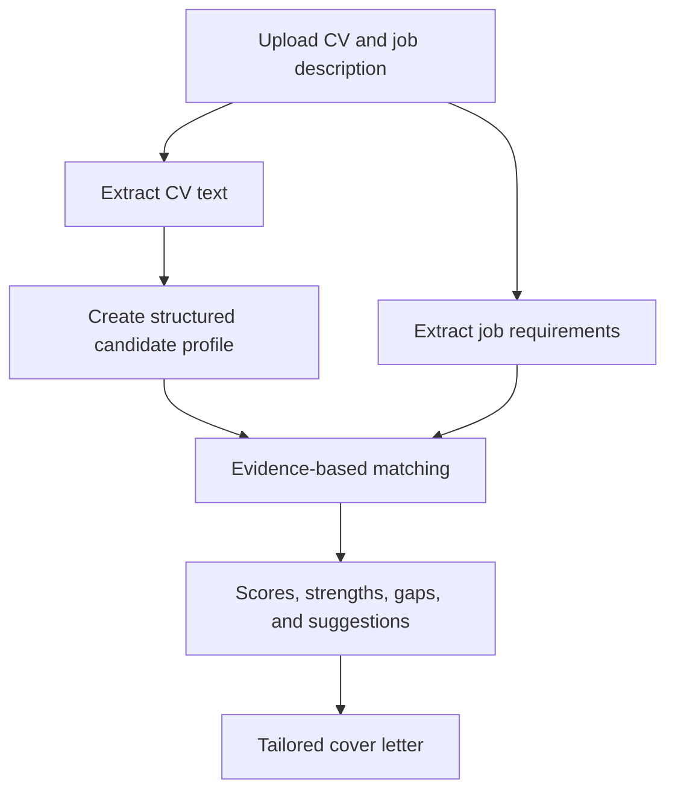

# AI Job Application Agent

[](https://www.python.org/)
[](https://fastapi.tiangolo.com/)
[](https://react.dev/)
[](https://www.typescriptlang.org/)

An AI-powered web application that compares a candidate's CV with a job description and produces an evidence-based job-match analysis.

The application extracts information from the CV and job advertisement, evaluates each requirement against verified CV evidence, highlights strengths and gaps, suggests practical CV improvements, and creates a tailored cover letter.

## Live Demo

- **Application:** [ai-job-agent-beige.vercel.app](https://ai-job-agent-beige.vercel.app)
- **API health:** [ai-job-agent-api.vercel.app/health](https://ai-job-agent-api.vercel.app/health)
- **Interactive API documentation:** [ai-job-agent-api.vercel.app/docs](https://ai-job-agent-api.vercel.app/docs)

## Features

- Upload CVs as PDF, PNG, JPG, or JPEG files.
- Read text-based PDFs, scanned PDFs, and CV images.
- Extract education, professional experience, projects, and technical skills.
- Extract technical, experience, education, and soft-skill requirements from job descriptions.
- Compare requirements with direct evidence found in the CV.
- Calculate category scores and an overall match score.
- Display strengths, missing requirements, and evidence-based reasons.
- Suggest CV improvements without inventing qualifications.
- Detect low alignment between a CV and a job description.
- Generate a tailored cover letter using only verified candidate evidence.
- Support different professions instead of being limited to software roles.

## Reliability and Safety

The project combines structured AI extraction with deterministic validation rules. AI output is validated with Pydantic before it reaches the user, while additional checks prevent related technologies, partial words, or unsupported claims from being treated as direct evidence.

When the CV does not support a requirement, the application marks it as missing instead of inventing experience. Cover-letter generation is also blocked when there is not enough verified evidence.

## How It Works



## Technology Stack

### Backend

- Python
- FastAPI
- Pydantic
- PyMuPDF
- Groq API
- Optional local Ollama provider
- Python unittest

### Frontend

- React
- TypeScript
- TanStack Router / TanStack Start
- Vite
- Tailwind CSS

### Deployment

- Vercel frontend deployment
- Vercel Python serverless backend

## Project Structure

```text
AI-Job-Agent/
├── ai_providers/           # Groq and Ollama integrations
├── api/                    # FastAPI application and routes
├── frontend/               # React and TypeScript frontend
├── tests/                  # Backend automated tests
├── ai_service.py           # Structured AI extraction
├── analysis_service.py     # Analysis pipeline
├── analyzer.py             # Deterministic matching logic
├── cover_letter_service.py # Evidence-based cover letters
├── cv_parser.py            # PDF and image CV processing
├── models.py               # Pydantic data models
└── settings.py             # Environment configuration
```

## Local Setup

### 1. Clone the repository

```bash
git clone https://github.com/christoshadj312-stack/AI-Job-Agent.git
cd AI-Job-Agent
```

### 2. Create the Python environment

Windows PowerShell:

```powershell
python -m venv .venv
.\.venv\Scripts\Activate.ps1
pip install -r requirements.txt
Copy-Item .env.example .env
```

### 3. Configure the AI provider

For Groq, update `.env`:

```env
AI_PROVIDER=groq
GROQ_API_KEY=your_groq_api_key
GROQ_MODEL=openai/gpt-oss-120b
GROQ_VISION_MODEL=qwen/qwen3.8-27b
CORS_ORIGINS=http://localhost:8080
```

Never commit a real API key.

The project can also run with local Ollama models by setting `AI_PROVIDER=ollama` and configuring the Ollama variables in `.env`.

### 4. Start the backend

```powershell
python -m uvicorn api.main:app --reload
```

The API will run at `http://127.0.0.1:8000`.

### 5. Start the frontend

Open a second PowerShell window and move to the `frontend` directory from the project root:

```powershell
cd frontend
npm install
$env:VITE_API_BASE_URL="http://127.0.0.1:8000"
npm run dev -- --port 8080
```

Open `http://localhost:8080` in your browser.

## Testing

Run the backend test suite from the project root:

```powershell
.\.venv\Scripts\python.exe -m unittest discover -s tests -v
```

Check the frontend TypeScript code:

```powershell
cd frontend
npx tsc --noEmit
```

## API Endpoints

| Method | Endpoint | Purpose |
| --- | --- | --- |
| `GET` | `/health` | Health check |
| `POST` | `/api/v1/analyses` | Analyse a CV against a job description |
| `POST` | `/api/v1/cover-letters` | Generate an evidence-based cover letter |

## Important Note

AI-generated analysis should support, not replace, human judgement. Candidates should review the results before using them in an application.

## Author

**Christos Hadjikyriakou**  
Mechanical Engineer with postgraduate studies in Artificial Intelligence.
